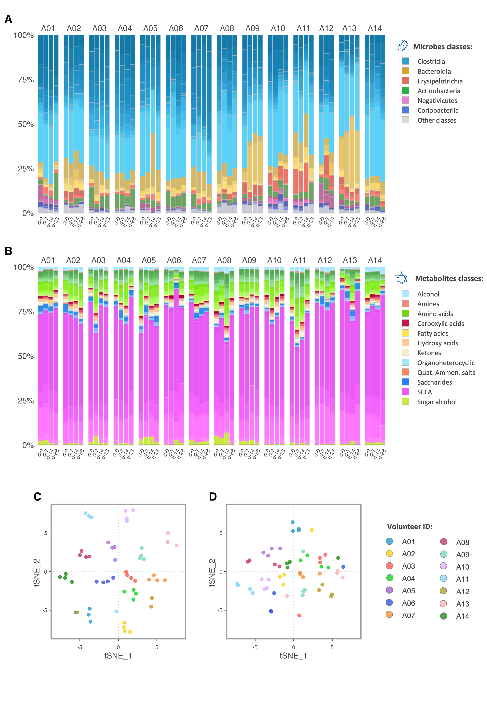
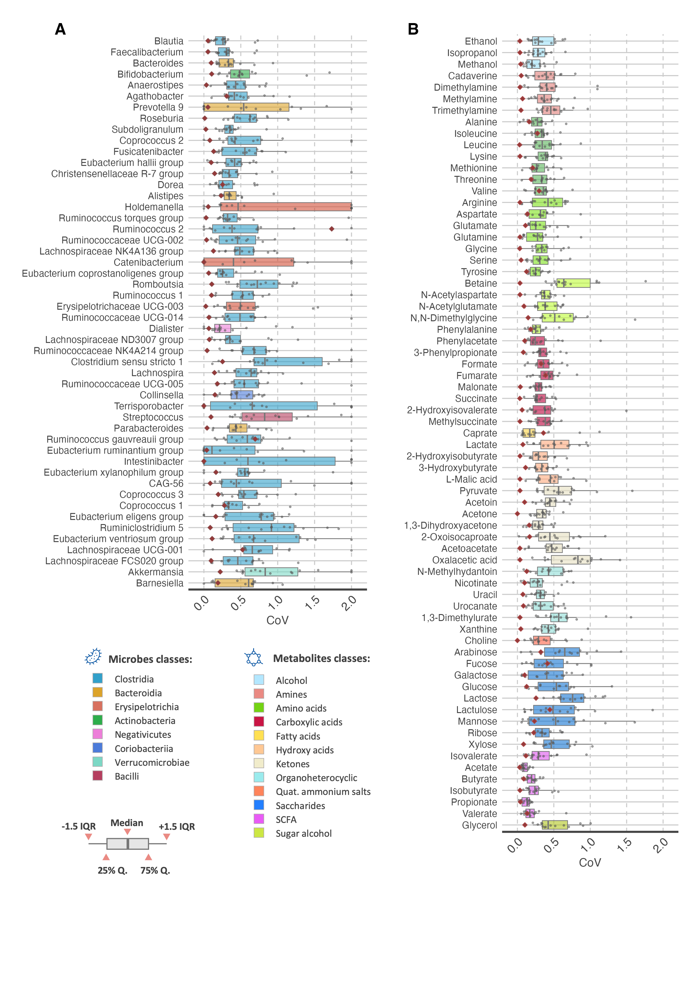
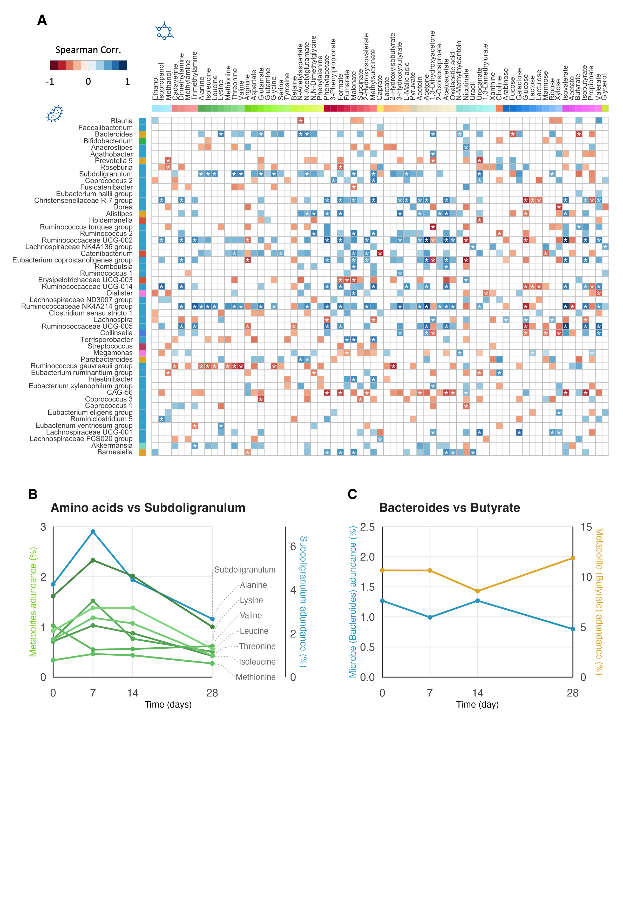

This repository contains scripts is associated with the paper:  

## Stability in fecal metabolites amid a diverse gut microbiome composition: a one-month longitudinal study of variability in healthy individuals. 
Published in ***Gut Microbes***, on 12 November 2024.

[Link to the paper](URL_of_your_paper)

[DOI: 10.1080/19490976.2024.2427878](https://doi.org/10.1080/19490976.2024.2427878)

#### Authors
**Matteo Sangermani**1,2, Indri Desiati3, Solveig M. Jørgensen3, Jia V. Li4, Trygve Andreassen3,5, Tone F. Bathen3, Guro F. Giskeødegård1,2

#### Affiliations
<h6>
1 Dep. of Public Health and Nursing NTNU, Trondheim. 
2 Dep of Surgery, St. Olavs University Hospital, Trondheim. 
3 Dep. of Circulation and Medical Imaging, NTNU, Trondheim. 
4 Department of Metabolism, Digestion and Reproduction, Imperial College London, London. 
5 Central Staff, St. Olavs Hospital HF, Trondheim. 
</h6>

## Description of the Scripts
This repository includes several scripts used in the study. Below is a brief overview of each:
- **Figure_1_Composition.R**: &nbsp;&nbsp;&nbsp;*Generates composition plots and tSNE clustering.*
- **Figure_2_CoV.R**: &nbsp;&nbsp;&nbsp;*Analyzes the Coefficient of Variation (CoV).*
- **Figure_3_Concentration_Plots.R**: &nbsp;&nbsp;&nbsp;*Tracks time changes for specific microbiome features and fecal metabolites.*
- **Figure_3_PartialSpearman.R**: &nbsp;&nbsp;&nbsp;*Correlation between microbiome and fecal metabolites.*
- **Figure_Suppl_1.R**: &nbsp;&nbsp;&nbsp;*Analyzes alpha and beta diversity of the gut microbiome.*
- **Figure_Suppl_2.R**: &nbsp;&nbsp;&nbsp;*Calculates CoV of microbial features at taxonomic ranks: class, family, genus.*
- **Figure_Suppl_3_ICC.R**: &nbsp;&nbsp;&nbsp;*Intraclass correlation analysis for microbial and fecal metabolites.*
- **Figure_Suppl_4.R**: &nbsp;&nbsp;&nbsp;*CoV of microbial taxa and metabolites grouped by individuals.*
- **Figure_Suppl_5.R**: &nbsp;&nbsp;&nbsp;*Scatter plot of the IQR vs. Median of each feature, extracted from the distribution of CoV values.*
- **Figure_Suppl_6.R**: &nbsp;&nbsp;&nbsp;*The same as Figure_3_Concentration_Plots.R plot analysis, but on different set of features.*

Each script is designed to be run independently to generate the figures presented in the published paper.

## Description of Data Tables:
Table used for analysis are included in this repository. Folder *Data_NMR* contains the quantification of fecal metabolites measured from NMR spectras, whereas  *Data_Seq* contains the count data and taxonomic information of microbiome features obtained with 16S rRNA sequencing. Below is an overview of the files:
- *Data_NMR*
	- *Metabolites_Concentration.txt*: absolute quantification of identified peaks (area under the fitted curve of the peaks; performed with Chenomx NMR Suite).
	- *Metabolites_MatchFactor.txt*: evaluation of the goodness of peak fitting, extrapolated from Chenomx NMR Suite.
	- *Metabolites_Ranking.txt* and *Metabolites_Ranking.xls*: classification and ranking of all the metabolites identified in the cohort (using Chenomx NMR Suite software). This act as a reference file that is used to classify metabolites and asign unique color, as well as having additional information from HMDB. NOTE: column "F_Type" is our own custom classification, partly based on HMDB classification.
	- *Ctrl_Repeated_Measurments.txt*: results of NMR repeated measurements from the same samples. This are used as controls in our analysis of the CoV.
	- *LUT_Metabolites*: LUT color table; each metabolite in the cohort is assigned a range of tonalities from the same base color (take from *Metabolites_Ranking.txt*).
	
- *Data_Seq*
	- *ASV_longit.tsv*: read count table of the cohort, where each column is a microbial ASV.
	- *TAXO_longit.tsv*: taxonomic information for each ASV present in the cohort.
	- *META_longit*: The metadata information of the cohort, such as "Sample_ID", "Exp_Group", "Exp_Name", "Exp_TimePoint", "Sex", etc.
	- *RefList_Class.txt* and *RefList_Phyla.txt*: a simple list of all the classes and phyla present in the cohort listed by abundance and with a reference color to use to coherently highlight features in plots.
	- *Drop_Features_Named.txt*: taxonomy in 16S rRNS sequencing is often incomplete, specifically at species rank. These is a list of names (such as "unkown", "unclassified genome", etc) that should ignore as "species" and such ASV will be re-labelled in the scripts.
	- *LUT_Microbes*: LUT color table; each class in the cohort is assigned a range of tonalities from the same base color.
## Main Figures
The following figures showcase the types of analyses or results generated by the scripts in this repository:

|  |  |  |
|---------------------------------------|---------------------------------------|---------------------------------------|
| Description of Figure 1               | Description of Figure 2               | Description of Figure 3               |

## Usage
To run these scripts, the following R packages are required:
#### Visualization:
- `ggplot2`
- `cowplot`
- `tiff`
- `ggrepel`
- `ggtext`
- `showtext`
#### Data Manipulation:
- `readr`
- `tidyr`
- `tibble`
- `dplyr`
#### Statistical Analysis:
- `Rtsne`
- `nlme`
- `nortest`
- `PResiduals` (for Partial Spearman correlation)

#### Setup Instructions:
In each script, change the variable `cDir_Rscript` to the **absolute path** of the repository on the machine running the code. All other paths are relative to this and follow Unix/MacOS format.

## Abstract of the paper
<h5>
	An extensive network of microbial-host interactions exists in the gut, making the gut microbiome a complex ecosystem to untangle. The microbial composition and the fecal metabolites are important readouts to investigate intricate microbiota-diet-host interplay. However, this ecosystem is dynamic, and it is of interest to understand the degree and timescale of changes occurring in the gut microbiota, during disease as well as in healthy individuals. Cross-sectional study design is often used to investigate the microbiome, but this design provides a static snapshot and cannot provide evidence on the dynamic nature of the gut microbiome. Longitudinal studies are better suited to extrapolate causation in a study or assess changes over time. 
	
	This study investigates longitudinal change in the gut microbiome and fecal metabolites in 14 healthy individuals with weekly sampling over a period of one-month (four time points), to elucidate the temporal changes occurring in the gut microbiome composition and fecal metabolites. Utilizing 16S rRNA amplicon sequencing for microbiome analysis and NMR spectroscopy for fecal metabolite characterization, we assessed the stability of these two types of measurable parameters in fecal samples during the period of one month. Our results show that the gut microbiome display large variations between healthy individuals, but relatively lower within-individual variations, which makes it possible to uniquely identify individuals. The fecal metabolites showed higher stability over time compared to the microbiome and exhibited consistently smaller variations both within and between individuals. This relative higher stability of the fecal metabolites suggests a balanced, consistent output even amid individual’s differences in microbial composition and they can provide a viable complementary readout to better understand the microbiome activity.
</h5>

